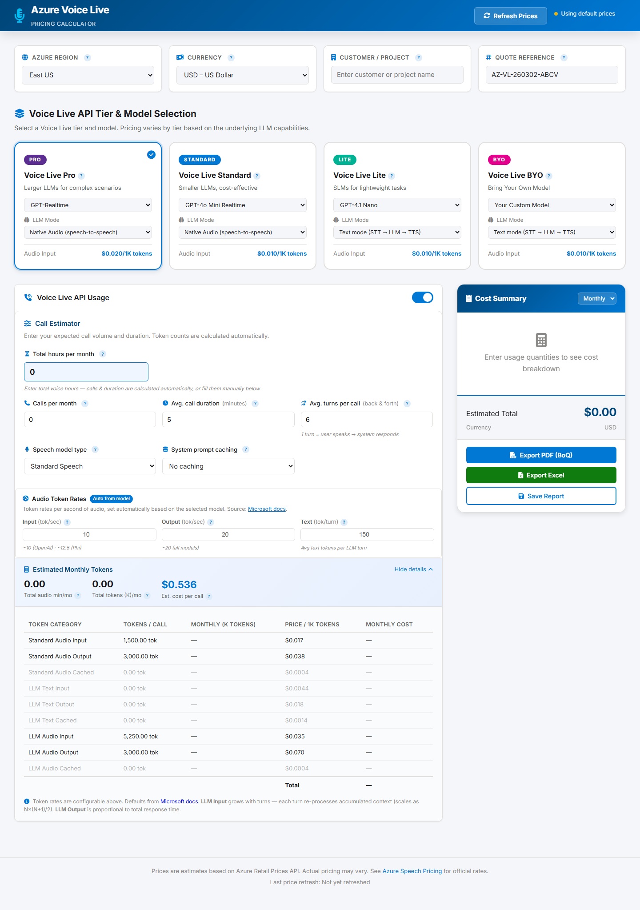
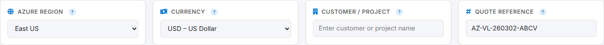
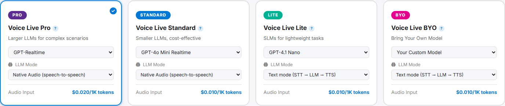
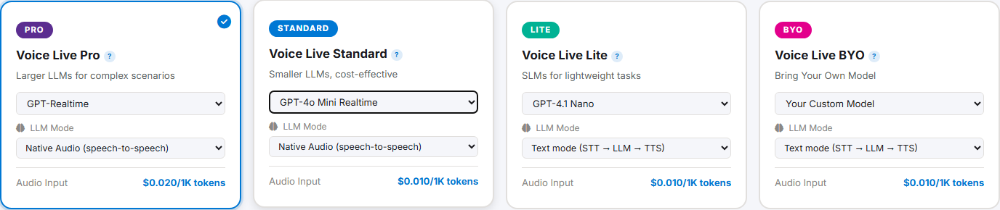
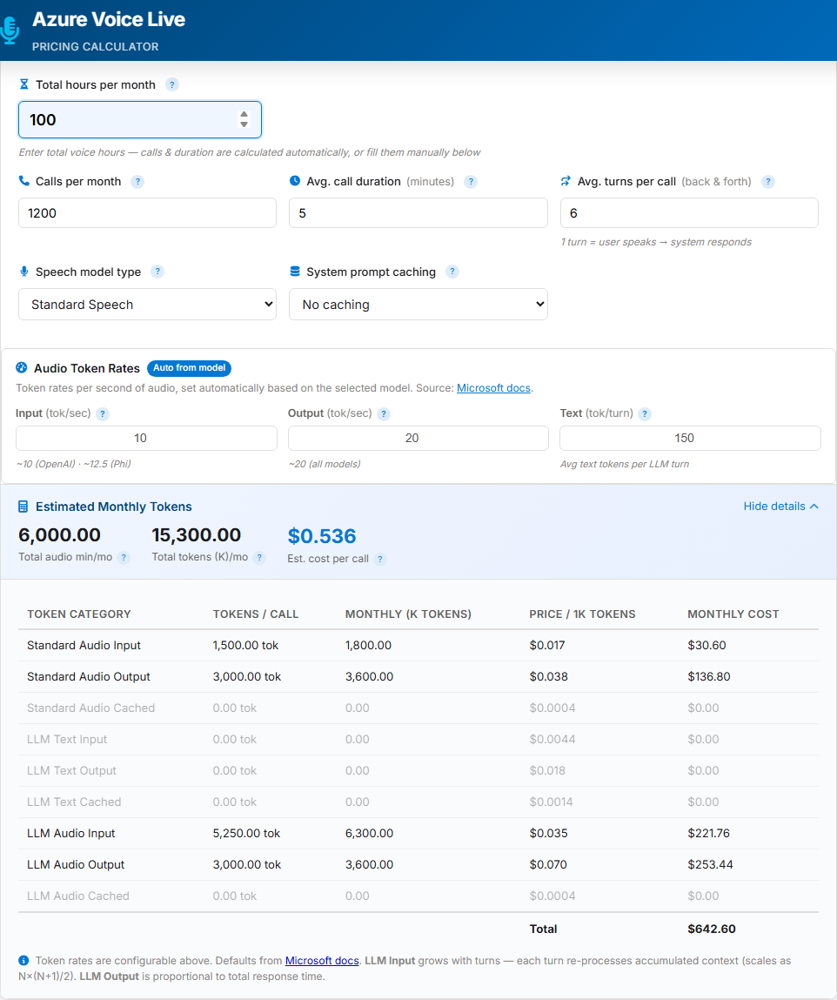
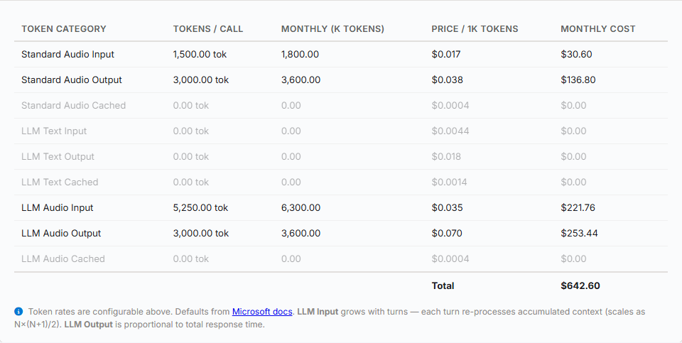
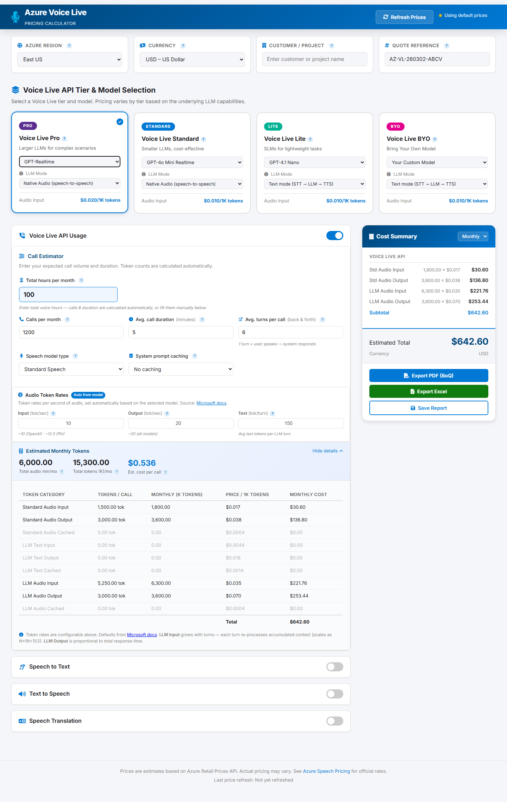
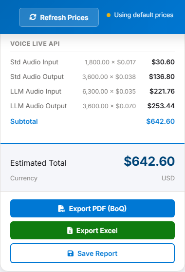

<div align="center">

# 🎙️ Azure Voice Live Pricing Calculator

**Estimate, compare, and export Azure Voice Live API costs — instantly.**

A professional-grade interactive pricing calculator for the [Azure Voice Live API](https://learn.microsoft.com/azure/ai-services/speech-service/voice-live), Microsoft's unified speech-to-speech platform for real-time voice agents. Pull live pricing from the Azure Retail Prices API, compare tiers and models side-by-side, and generate production-ready quotes.

[](https://learn.microsoft.com/azure/ai-services/speech-service/voice-live)
[](https://python.org)
[](https://flask.palletsprojects.com)
[](#-deploying-to-azure)
[](LICENSE)

</div>

<br>

<p align="center">
  
</p>
<p align="center"><em>The full dashboard: configure region and currency, select a tier and model, set call volume, and review costs — all in one view.</em></p>

---

## 📋 Table of Contents

- [Overview](#-overview)
- [How It Works](#-how-it-works)
- [Using the Calculator](#-using-the-calculator)
- [Running Locally](#-running-locally)
- [Deploying to Azure](#-deploying-to-azure)
- [Project Structure](#-project-structure)
- [Configuration Reference](#-configuration-reference)
- [References & Resources](#-references--resources)

---

## 🔍 Overview

The **Azure Voice Live API** is a fully managed service enabling low-latency, high-quality speech-to-speech interactions for voice agents. It unifies speech recognition, generative AI, and text-to-speech into a single interface — but its pricing model is complex: multiple tiers, multiple models, multiple billing meters, caching discounts, and LLM processing modes that all interact.

This calculator lets you model any scenario in seconds:

| | |
|---|---|
| 📊 **Estimate costs** | Model monthly costs across all 4 Voice Live tiers with real Azure pricing |
| 🔄 **Compare models** | GPT-Realtime, GPT-4o, GPT-4.1, GPT-4.1 Nano, Phi — see cost impact instantly |
| 🧮 **Smart token math** | Auto-calculates token consumption from hours, calls, turns, and caching levels |
| 📄 **Export quotes** | Generate professional PDF and Excel quotes for customer presentations |
| 💾 **Save & reload** | Cloud-persist reports to Azure Blob Storage with Entra ID authentication |
| 🌍 **Multi-region** | 25+ Azure regions, 17 currencies, live exchange rates |

---

## ⚙️ How It Works

### Architecture

```
┌──────────────────────────────────────────────────────────────┐
│                       Browser (Client)                       │
│  ┌────────────┐  ┌────────────┐  ┌──────────┐  ┌──────────┐ │
│  │ index.html │  │   app.js   │  │styles.css│  │ MSAL.js  │ │
│  └────────────┘  └────────────┘  └──────────┘  └──────────┘ │
└──────────────────────────┬───────────────────────────────────┘
                           │ HTTP
┌──────────────────────────▼───────────────────────────────────┐
│                   Flask Server (server.py)                    │
│                                                              │
│  GET  /                  → Static files (HTML/JS/CSS)        │
│  GET  /api/retail/prices → Proxy → Azure Retail Prices API   │
│  GET  /api/auth/config   → Entra ID configuration            │
│  GET  /api/reports       → List saved reports (JWT auth)     │
│  POST /api/reports       → Save report (JWT auth)            │
│  DEL  /api/reports/:id   → Delete report (JWT auth)          │
└───────┬──────────────────────────────────────┬───────────────┘
        ▼                                      ▼
┌───────────────┐                   ┌────────────────────┐
│  Azure Retail │                   │  Azure Blob        │
│  Prices API   │                   │  Storage (reports)  │
└───────────────┘                   └────────────────────┘
```

> **Why a server-side proxy?** The Azure Retail Prices API does not return CORS headers, so browser `fetch()` calls are blocked. The Flask server proxies these requests server-side.

### Voice Live Tiers

Voice Live pricing is tier-based, driven by the generative AI model you select:

| Tier | Models | Best For | Cost |
|:-----|:-------|:---------|:----:|
| 🟣 **Pro** | GPT-Realtime, GPT-4o, GPT-4.1 | Complex, high-quality conversations | $$$ |
| 🔵 **Standard** | GPT-4o Mini Realtime, GPT-4o Mini, GPT-4.1 Mini | Balanced cost and quality | $$ |
| 🟢 **Lite** | GPT-4.1 Nano, Phi Models | High-volume simple tasks, FAQ bots | $ |
| ⚪ **BYO** | Your custom model | Full control — only audio I/O charged | Varies |

Each tier charges across multiple billing meters (text tokens, standard audio, custom audio, and native LLM audio). The BYO tier only charges for audio input/output — you bring your own LLM.

### LLM Processing Modes

Each tier supports one or more processing modes that determine how audio flows through the AI model:

| Mode | Pipeline | When to Use |
|:-----|:---------|:------------|
| **Native Audio** | `Audio → LLM → Audio` | Lowest latency — GPT-Realtime handles audio natively |
| **Text** | `Audio → STT → LLM → TTS → Audio` | Classic pipeline for text-only LLMs (GPT-4o, Phi) |
| **Both** | Native Audio + Text simultaneously | Maximum quality with redundancy; both token types charged |

> 💡 Token rates are auto-set per model family: OpenAI models generate ~10 audio input tokens/sec and ~20 output tokens/sec; Phi models generate ~12.5 input and ~20 output. Source: [Microsoft docs](https://learn.microsoft.com/azure/ai-services/speech-service/voice-live#token-usage-and-cost-estimation).

---

## 🧭 Using the Calculator

### Step 1 — Configure Region & Currency

The **configuration panel** at the top of the page lets you set the context for your pricing estimate: Azure region (pricing varies by datacenter), display currency, customer or project name (appears on exported quotes), and an auto-generated quote reference for tracking.

<p align="center">
  
</p>
<p align="center"><em>Configuration panel — set your Azure region, currency, customer name, and quote reference before estimating costs.</em></p>

### Step 2 — Select a Tier & Model

Click one of the four **tier cards** to choose your Voice Live pricing tier. Each card contains:

- A **model dropdown** with the LLMs available for that tier
- An **LLM Processing Mode** selector (Native Audio, Text, or Both) — options filter automatically based on model compatibility
- A **price preview** showing the per-1K-token rate for the selected model

When you select a tier, the audio token rates (input/output tok/sec) and text tokens per turn update automatically based on the model family.

<p align="center">
  
</p>
<p align="center"><em>Tier cards — Pro is selected by default. Each card shows the available models and LLM processing mode for that tier.</em></p>

<p align="center">
  
</p>
<p align="center"><em>Selecting the Standard tier highlights it and updates the model dropdown and LLM mode options accordingly.</em></p>

### Step 3 — Configure Call Volume & Token Estimation

The **Call Estimator** is the core input section. You can either:

- Enter **total hours per month** — the calculator automatically derives calls and duration, or
- Manually set **calls per month**, **average call duration** (minutes), and **turns per call**

Additional controls include:
- **Speech model type** — Standard (Azure prebuilt voices) or Custom (your trained models, billed at custom rates)
- **System prompt caching** — None, Light (~20% cached), or Heavy (~50% cached) to model caching discounts
- **Audio token rates** — Displayed as read-only fields, auto-set from the selected model family

<p align="center">
  
</p>
<p align="center"><em>Call estimator — enter your usage parameters and the calculator computes token consumption automatically. Token rates (bottom row) are locked to model-specific values.</em></p>

Below the estimator, a **token breakdown table** shows the exact monthly token counts and costs per billing category: audio input, audio output, LLM text input/output, LLM audio input/output, and cached tokens. This is the detailed view that backs the summary numbers.

<p align="center">
  
</p>
<p align="center"><em>Token breakdown — every billing meter itemized with tokens per call, monthly totals, unit price, and monthly cost.</em></p>

### Step 4 — Toggle Additional Services

Below the Voice Live section, toggle switches enable additional Azure Speech services. Each has its own set of inputs and meters:

- **Speech to Text** — Real-time or batch transcription (Standard or Custom)
- **Text to Speech** — Neural, HD Neural, or Custom voice synthesis
- **Speech Translation** — Real-time translation
- **Live Interpreter** — Full interpretation pipeline
- **Video Translation** — Video dubbing and translation

<p align="center">
  
</p>
<p align="center"><em>Additional services enabled — STT, TTS, and Translation sections appear below the Voice Live estimator, each with their own usage inputs.</em></p>

### Step 5 — Review & Export

The **Cost Summary** sidebar on the right updates in real time as you adjust any parameter. It shows:

- Per-service line-item costs
- Monthly or yearly totals (toggle via dropdown)
- Three export actions:
  - **Export PDF** — Professional Bill of Quantities document
  - **Export Excel** — Detailed spreadsheet with formatted tables
  - **Save Report** — Persist to Azure Blob Storage (requires sign-in)

Click **Refresh Prices** in the header at any time to pull the latest rates from the Azure Retail Prices API. A status indicator shows whether you're using live or fallback prices.

<p align="center">
  
</p>
<p align="center"><em>Cost summary — real-time cost breakdown with PDF, Excel, and cloud save options.</em></p>

---

## 🏃 Running Locally

**Prerequisites:** Python 3.10+ and pip.

```bash
# Clone the repository
git clone https://github.com/amantaras/voice-live-pricing.git
cd voice-live-pricing

# Install dependencies
pip install -r requirements.txt

# Start the server
python server.py
```

Open **http://localhost:8080** in your browser. The calculator works immediately for pricing estimation, PDF export, and Excel export.

> 📝 Authentication and cloud report saving require Azure configuration (Entra ID app registration + Blob Storage). See [Deploying to Azure](#-deploying-to-azure) for setup.

---

## ☁️ Deploying to Azure

Deploy to **Azure Container Apps** with a single command using the [Azure Developer CLI](https://learn.microsoft.com/azure/developer/azure-developer-cli/).

### What gets provisioned

| Resource | Purpose |
|:---------|:--------|
| **Azure Container Apps** | Hosts the Flask application (scales 0–3 replicas) |
| **Azure Container Registry** | Stores the Docker image (Basic SKU) |
| **Azure Storage Account** | Blob container for saved reports |
| **Log Analytics Workspace** | Application monitoring and diagnostics |
| **Managed Identity** | Zero-secret auth with Storage Blob Data Contributor role |

### Step 1: Register an Entra ID Application

```bash
az ad app create \
  --display-name "Voice Live Pricing Calculator" \
  --sign-in-audience AzureADMyOrg \
  --web-redirect-uris "http://localhost:8080"

# Note the appId, then set the identifier URI
az ad app update --id <appId> --identifier-uris "api://<appId>"
```

### Step 2: Deploy

```bash
azd init
azd env set AZURE_CLIENT_ID <your-app-id>
azd up
```

### Step 3: Update Redirect URI

After deployment, update the redirect to your Container App's URL:

```bash
az ad app update --id <appId> \
  --web-redirect-uris "https://<your-app>.azurecontainerapps.io"
```

<details>
<summary><strong>Infrastructure Details (Bicep)</strong></summary>

| File | Purpose |
|:-----|:--------|
| `infra/main.bicep` | Subscription-scoped orchestrator |
| `infra/main.parameters.json` | Parameter definitions with azd env vars |
| `infra/modules/container-app.bicep` | Container Apps Environment, ACR, Container App, RBAC |
| `infra/modules/storage.bicep` | Storage Account with `reports` container |
| `infra/abbreviations.json` | Resource naming abbreviations |

</details>

---

## 📁 Project Structure

```
voice-live-pricing/
│
├── index.html                  # Main application page
├── app.js                      # Calculator logic, pricing engine, exports, auth
├── styles.css                  # Complete application styling (~1000 lines)
├── server.py                   # Flask server — proxy, auth, reports API
├── requirements.txt            # Python dependencies
│
├── Dockerfile                  # Container image (Python 3.12 + gunicorn)
├── .dockerignore               # Docker build exclusions
├── azure.yaml                  # Azure Developer CLI service definition
│
├── screenshots.py              # Playwright script to regenerate screenshots
│
├── docs/
│   └── images/                 # Auto-generated screenshots for documentation
│       ├── 01-dashboard-overview.png
│       ├── 02-config-panel.png
│       ├── 03-tier-selection.png
│       ├── 04-tier-standard-selected.png
│       ├── 05-call-estimator.png
│       ├── 06-token-breakdown.png
│       ├── 07-cost-summary.png
│       └── 08-full-page-with-services.png
│
└── infra/                      # Azure infrastructure (Bicep)
    ├── main.bicep
    ├── main.parameters.json
    ├── abbreviations.json
    └── modules/
        ├── container-app.bicep
        └── storage.bicep
```

---

## 🔧 Configuration Reference

### Environment Variables

| Variable | Description | Required |
|:---------|:------------|:--------:|
| `AZURE_TENANT_ID` | Microsoft Entra ID tenant ID | Auth |
| `AZURE_CLIENT_ID` | App registration client ID | Auth |
| `AZURE_STORAGE_ACCOUNT_NAME` | Storage account for saved reports | Save |
| `REPORTS_CONTAINER` | Blob container name (default: `reports`) | — |
| `PORT` | Server port (default: `8080`) | — |

### Token Rate Defaults

Per [Microsoft documentation](https://learn.microsoft.com/azure/ai-services/speech-service/voice-live#token-usage-and-cost-estimation):

| Model Family | Input (tok/sec) | Output (tok/sec) |
|:-------------|:---------------:|:-----------------:|
| Azure OpenAI (GPT-4o, GPT-4.1, etc.) | ~10 | ~20 |
| Phi Models | ~12.5 | ~20 |

### Regenerating Screenshots

Screenshots are auto-generated via Playwright. To update after UI changes:

```bash
pip install playwright && playwright install chromium
python server.py &     # start the server
python screenshots.py  # capture all screenshots
```

---

## 📚 References & Resources

| Resource | Link |
|:---------|:-----|
| Voice Live API Overview | [learn.microsoft.com](https://learn.microsoft.com/azure/ai-services/speech-service/voice-live) |
| Voice Live How-To Guide | [learn.microsoft.com](https://learn.microsoft.com/azure/ai-services/speech-service/voice-live-how-to) |
| Azure Speech Pricing | [azure.microsoft.com](https://azure.microsoft.com/pricing/details/cognitive-services/speech-services/) |
| Azure Retail Prices API | [learn.microsoft.com](https://learn.microsoft.com/rest/api/cost-management/retail-prices/azure-retail-prices) |
| Voice Live API Reference | [learn.microsoft.com](https://learn.microsoft.com/azure/ai-services/speech-service/voice-live-api-reference-2025-10-01) |
| Azure Developer CLI (azd) | [learn.microsoft.com](https://learn.microsoft.com/azure/developer/azure-developer-cli/) |

---

## 📄 License

This project is provided as-is for estimation purposes. Azure pricing may change — always verify with the [official Azure pricing page](https://azure.microsoft.com/pricing/details/cognitive-services/speech-services/).

---

<div align="center">

**Built with** ❤️ **for the Azure Speech community**

[Report an Issue](https://github.com/amantaras/voice-live-pricing/issues) · [Request a Feature](https://github.com/amantaras/voice-live-pricing/issues/new)

</div>
